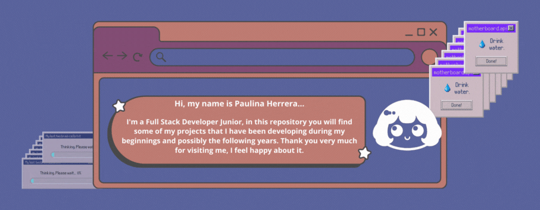

# 🥹Wellcome to my GitHub🤗

Let's connect ('. • ᵕ •.`)

Things that I use ('. • ω •.`) ♡

Common tools in my daily schedule (⌒ω⌒) ノ

My basics... I think ... ミ ヽ (>. <) ノ

Design Tools ヾ ('〇 `) ノ ♪♪♪

